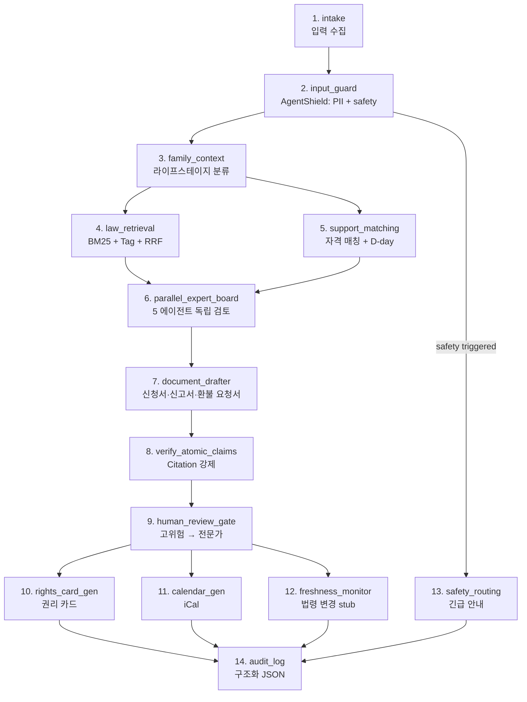

# 자람법 Architecture

## 14노드 워크플로우



## 노드별 책임

| # | 노드 | 모듈 | 책임 |
|---|---|---|---|
| 1 | intake | (CLI / fixture) | 부모 입력 수집 |
| 2 | input_guard | `guard.py` | PII 마스킹 + prompt injection 차단 + safety 신호 감지 |
| 3 | family_context | `family_context.py` | 생년월일 → 라이프스테이지, 특수상황 태그 |
| 4 | law_retrieval | `law_retrieval.py` | 시드 yaml 로드 + hybrid retrieval |
| 5 | support_matching | `support_matching.py` | 가족 프로필 → 자격 매칭 + D-day |
| 6 | parallel_expert_board | `orchestrator._board_opinions` | 5 에이전트 독립 검토 |
| 7 | document_drafter | `document_drafter.py` | 신청서·신고서·환불 요청서 초안 + 환불액 계산 |
| 8 | verify_atomic_claims | `verifier.py` | Citation 강제 (Constitution 원칙 2) |
| 9 | human_review_gate | `human_review.py` | 고위험·저신뢰 → 전문가 라우팅 |
| 10 | rights_card_gen | `rights_card.py` | 권리 카드 markdown + JSON |
| 11 | calendar_gen | `calendar_gen.py` | 영유아 건강검진·예방접종·학사 iCal |
| 12 | freshness_monitor | (MVP stub) | 법령 변경 감지 |
| 13 | safety_routing | `guard.py` (직접 출력) | 학대/응급/자해/가정폭력 — 1577-1391 / 119 / 1393 / 1366 |
| 14 | audit_log | `audit.py` | 구조화 JSON + audit_log_id |

## 데이터 흐름 (FamilyProfile 중심)

```
사용자 입력 (dict)
  ↓
guard.run_guard → GuardResult (redacted + safety)
  ↓
family_context.build_family_profile → FamilyProfile
  ↓
+---------+ +--------------+
| law_retr| | support_match|
| (laws)  | | (supports)   |
+---------+ +--------------+
  ↓ matched_laws ↓ support_matches
  ↓
parallel_expert_board → board_opinions: {5 에이전트}
  ↓
document_drafter → draft_documents
  ↓
verify_atomic_claims → VerifierResults (verified/partial/unverifiable)
  ↓
human_review_gate → HumanReviewSection
  ↓
+--------------+ +--------------+
| rights_card  | | calendar_gen |
+--------------+ +--------------+
  ↓ rights_cards ↓ calendar
  ↓
audit_log → FinalReport JSON + audit_log_id
```

## Multi-Agent Board (5 에이전트)

`parallel_expert_board` 노드 = 5 에이전트의 독립 검토를 통합 (병렬 의도, deterministic 정리).

| 에이전트 | 역할 | Builder/Verifier |
|---|---|:---:|
| law-retrieval-agent | 매칭된 법령 검토 | Builder |
| family-context-agent | 라이프스테이지 일관성 검사 | Builder |
| support-matching-agent | 누락 가능 지원 식별 | Builder |
| document-drafter-agent | 초안 적절성 사전 검토 | Builder |
| contrarian-verifier | **반증·예외 적극 탐지** (Reality Checker 패턴) | **Verifier** |

Builder ≠ Verifier 격리 → Constitution 원칙 2 강제력 보장.

## Constitution 5원칙 강제 지점

```
input → [원칙 5 PII] guard.apply_pii_redaction
              ↓
        [원칙 3 Safety] guard.detect_safety_signals
              ↓
        ... 14 노드 ...
              ↓
        [원칙 2 Citation] verifier.verify_claims
              ↓
        [원칙 1 Disclaimer] FinalReport.disclaimer 자동 삽입
              ↓
        [원칙 4 No-side-effects] workflow.safety_tokens: external_side_effect_tools_allowed=[]
              ↓
        audit_log
```

## seeded mode vs API mode

| 모드 | 트리거 | 동작 |
|---|---|---|
| seeded (기본) | `LAW_API_KEY` 미설정 | 시드 yaml만 사용. 외부 호출 없음. 결정론적. |
| api (후속) | `LAW_API_KEY` 설정 | LawApiClient가 law.go.kr 호출하여 보강 (MVP 미구현) |

MVP에서는 seeded mode가 **결정론적 데모 + 보안 안전성** 보장 — 공모전 시연에 최적.

## 외부 통합

- **AITHOR-Agent-Framework**: workflow YAML 패턴, AgentShield/AgentLoop 사상 mirror
- **LAW.OS** (옵션): LawApiClient 인터페이스 stub. 후속 통합 시 law_retrieval에서 `client.search_current_laws()` 활용
- **AI-research-SKILLs**: 10 카테고리 활용. 상세: `ai-research-skills-integration.md`
